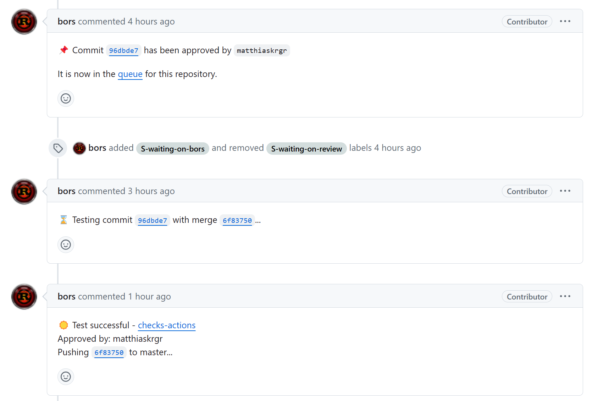

# Rust Bots 系列 - bors

在 Rust 官方项目中，bors 用来作为合并前的最后一道检查，由具有合入权限的 committer 或者 member 触发，触发后会按照需要重新执行一遍门禁检查。门禁检查通过后，会自动将代码合入主线，并关闭当前合入请求。



## bors

[项目地址]: https://github.com/rust-lang/bors

bors 最新版本是由 infra 项目组几个 maintainer 用 Rust 重构的，之前版本是 [homu](https://github.com/rust-lang/homu)，这里只介绍重构后 bors 的部署方式。

首先确认我们需要什么，参考命令如下：

| **CLI flag**       | **Environment var.** | **Default** | **Description**                                              |
| ------------------ | -------------------- | ----------- | ------------------------------------------------------------ |
| `--app-id`         | `APP_ID`             |             | GitHub app ID of the bors bot.                               |
| `--private-key`    | `PRIVATE_KEY`        |             | Private key of the GitHub app.                               |
| `--webhook-secret` | `WEBHOOK_SECRET`     |             | Key used to authenticate GitHub webhooks.                    |
| `--db`             | `DB`                 |             | Database connection string. PostgreSQL and SQLite are supported. |
| `--cmd-prefix`     | `CMD_PREFIX`         | @bors       | Prefix used to invoke bors commands in PR comments.          |

### 1.项目准备

**项目配置 - 创建分支**

有两个比较重要的分支会被 bors 使用：

- `automation/bors/try-merge`

  该分支会自动 reset 成 master 分支代码，并尝试与最新的 commit 进行合并，并检查合并是否有冲突，因为无法保证该操作的原子性，所以一般情况下，测试由下面的分支进行。

- `automation/bors/try`

  进行最新 commit 的 CI 检查工作。

**项目配置 - 配置 github app 及 webhook**

切换到 bot 账户，进入 setting，选择添加 github app，其中 webhook 地址为 `<http address of bors>/github`。

创建完 github app 后，会生成 `app-id`、`private-key` 以及 `webhook-secret`。将其记录并保存。

将 github app 下载到对应的 bot 账户，使用该 bot 账户作为触发 bors 的机器人账户需要保证该账户具有项目的相关权限。

**项目配置 - 配置文件 rust-bors.toml**

项目下添加 `rust-bors` 的配置文件。

参考格式

```toml
# Maximum duration of CI workflows before the are considered timed out.
# (Required)
timeout = 3600

# Labels that should be set on a PR after an event happens.
# "+<label>" adds the label, while "-<label>" removes the label after the event.
# Supported events:
# - try: Try build has started
# - try_succeed: Try build has finished
# - try_failed: Try build has failed
# (Optional)
[labels]
try = ["+foo", "-bar"]
try_succeed = ["+foobar", "+foo", "+baz"]
try_failed = []
```

### 2.部署 bors

**部署 - db**

- 安装 sea-orm-cli

```shell
cargo install sea-orm-cli
```

- 设置 `DATABASE_URL`

```shell
export DATABASE_URL=sqlite://bors.db?mode=rwc
```

- 初始化 Postgre DB

```shell
sea-orm-cli migrate -d database/migration/ up
```

- 重新初始化

```
sea-orm-cli generate entity -o database/entity/src --lib
```

**部署 - 运行**

上一步会生成一个 bors.db 

```
./target/release/bors --app-id 871513 --private-key "" --webhook-secret mybors --db sqlite://bors.db?mode=rwc
```


### 3.测试及验证

当前 bors 支持的命令集包括（通过 @bors 触发）：

| **Command**        | **Permissions** | **Description**                                              |
| ------------------ | --------------- | ------------------------------------------------------------ |
| `ping`             |                 | Send a ping to bors to check that it responds.               |
| `try`              | `try`           | Start a try build based on the most recent commit from the main branch. |
| `try parent=<sha>` | `try`           | Start a try build based on the specified parent commit `sha`. |
| `try cancel`       | `try`           | Cancel a running try build.                                  |

效果如下：

